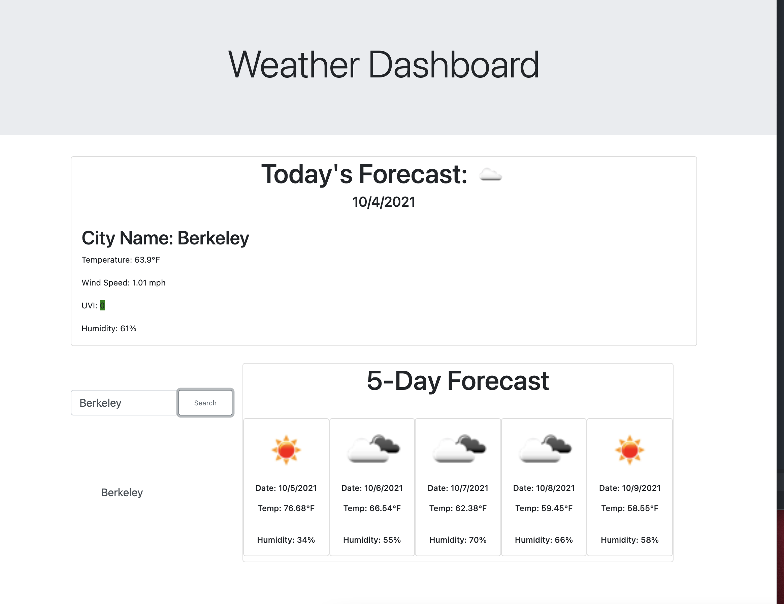
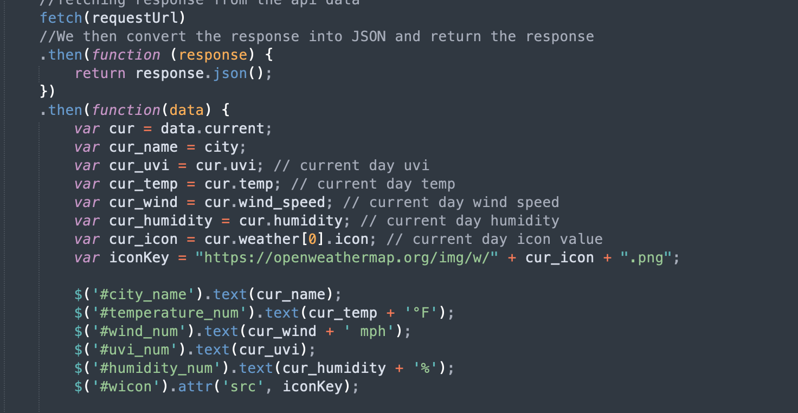

# Weather Dashboard
I was given the task to create a webpage that will display the weather of a city and its 5 day forecast. Moreover, the webpage should store the data locally of recently searched cities. 

## Site Picture

## Technologies Used
- HTML 
- CSS 
- Git 
- GitHub 

## Summary 
I started this project by first requesting data from the api server. Initially, I made two unique api calls to different databases in order to acces the information of one I needed the latitude and longitude of the specific city. In order to find this, I made an api call to one of openweathers api. This api was not sufficient in providing other information, but it allowed me to acces the one call api. . After gathering all the necessary data I assigned the needed information to variables and would dynamically add the content to the webpage. After displaying the current weather, I then worked on creating a history of searched cities. I would store the latitude/longitude and name of the city in order to recall the past data. I stored the information locally. After completing the history, I worked on the forecast cards where there were five cards that provided the weather information and date. Finally, I used the Date() function in order to figure out the current date and within a for loop I then calculated the following days. 

## Deployable Link 
[Link](https://danielvo1.github.io/weather_dashboard/)

## Author Links 
[Github](https://github.com/danielvo1)
